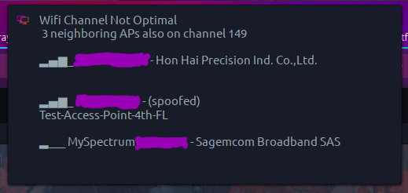
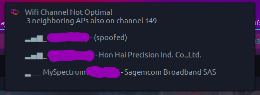
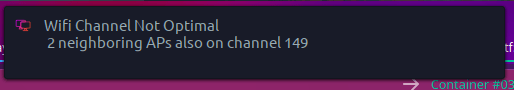

# Wifi Channel Watcher for GNU/Linux-based desktop environments
Assess channel usage of neighboring routers / access points and get a desktop alert if your active channel is not optimal (has more than 1 user on it, other than you).  Troubleshoot your wifi without lifting a finger!

Additional options:
- MAC address/BSSID lookups of neighbors - Useful when troubleshooting rogue access points or evil twin attacks
- MAC address caching - No need to pull lookups from the internet when most neighboring routers are likely static
- Enterprise access point lookup - Useful when you have several access points with the same SSID; reference a list of BSSIDs and easily set custom identifiers (see 'Full Detail' screenshot)

***
### Full Detail


### Without Custom Access Point Lookups


### Minimum Detail

***

> If you're in an extremely dense area, you may want to customize the threshold from `"$TOTAL_ACTIVE" -gt 0` to something that better suits your environment.

## Dependencies / Requirements
- [**libnotify-bin**](https://packages.debian.org/buster/libnotify-bin) (notify-send) - Sends the desktop notifications
- [**network-manager**](https://packages.debian.org/buster/network-manager) (nmcli)- Wifi scanning without requiring elevation; this is *Gnome-based*
- [**iw**](https://packages.debian.org/buster/iw) - Some overlap with nmcli, is used to obtain info about your SSID to check the channel before handoff to nmcli

    - Should work in non-Linux based systems with network-manager & libnotify-bin, but untested


  - Install dependencies on a Debian-based system:
  ```bash
  sudo apt install libnotify-bin network-manager iw
  ```

## Installation
1. After installing dependencies (most Gnome users may already have them), clone the repo to a directory on your hard drive where you'll be able to reference it for a cron
  ```bash
  git clone https://github.com/angela-d/wifi-channel-watcher.git
  ```

2. Set up a cron to run every 10 minutes (adjust to suit)
  ```bash
  crontab -e
  ```

  with the following:
  ```bash
  */10 * * * * /your/directory/path/to/wifi-channel-watcher/channel-watch
  ```
  (be sure to modify `/your/directory/path/to` to match the local path you cloned this repo to)

That's it.

You can manually run the script any time via command-line:
```bash
/your/directory/path/to/wifi-channel-watcher/channel-watch
```

## Customizing
All customizations are optional, in most cases, the script will work out of the box.

Config options are in the top of the script, `channel-watch`
- **DISPLAY_CHANNEL_BSSID** = Turn the BSSID, bars and manufacturer info on or off
  - `1` = maximum detail
  - `0` = only active channel count (besides yourself) is displayed
- **MAC_LIST** = (optional) Specify a local cache of the [standards-oui.ieee.org](http://standards-oui.ieee.org) list, if you don't want your machines pulling it from the web
  - Example value: `http://company.example.com/mac.txt`
  - `""` = Pulled from the web and cached for later use
- **AP_LIST** = (optional) Reference a list of internal access points by their BSSID; assign custom, friendly names
  - Two columns, tab separated; with colons `:` stripped
  - See [arrays.txt](https://github.com/angela-d/wifi-channel-watcher/blob/main/examples/arrays.txt) for example usage
  - Example value: `http://company.example.com/arrays.txt`
- **INTERNAL_CHECK** = (optional) An internal resource on your private network, not accessible to the internet that's used to determine whether or not to use internal lists, or pull a list off the web for caching
  - Example value: `print.example.com`
- Custom icon: default image is from [OieIcons](https://www.pling.com/p/1299058/), you can add your own by replacing **icon.svg**:
  - Main folder (see [icon.svg](https://github.com/angela-d/wifi-channel-watcher/blob/main/icon.svg))
  - After first run, the icon is copied to: `~/.config/wifi-channel-watcher/icon.svg` -- this is the one you'd want to replace for an immediate change; otherwise, the icon in the root directory only copies over once the `~/.config/wifi-channel-watcher/` folder isn't detected
  - Overall text, image and appearance of the notification will vary depending on what desktop theme you're using
