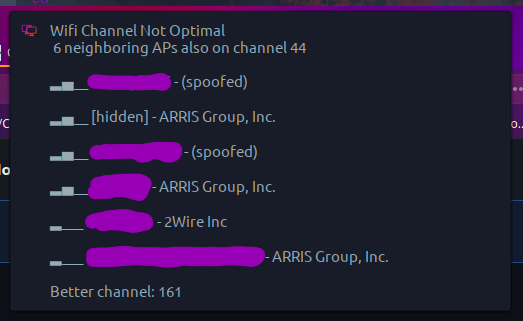

# Wifi Channel Watcher for GNU/Linux-based desktop environments
Monitor channel usage of neighboring routers / access points and get a desktop alert if your active channel is not optimal (has more than 1 user on it, other than you).  Troubleshoot your wifi without lifting a finger!

Additional options:
- Suggest a better, less congested channel
- MAC address/BSSID lookups of neighbors - Useful when troubleshooting rogue access points or evil twin attacks
- MAC address caching - No need to pull lookups from the internet when most neighboring routers are likely static
- Enterprise access point lookup - Useful when you have several access points with the same SSID; reference a list of BSSIDs and easily set custom identifiers (see 'Full Detail' screenshot)

***
### Better Channel Suggestion


### Full Detail


### Without Custom Access Point Lookups


### Minimum Detail

***

> If you're in an extremely dense area, you may want to customize the threshold from `"$TOTAL_ACTIVE" -gt 0` to something that better suits your environment.

## Installation
This script can be cloned and run manually, or added as a service that runs on a scheduled interval.

See [detailed install instructions](https://github.com/angela-d/wifi-channel-watcher/wiki/Installing) for built-in systemd user service options (no sudo/root needed).

- After installing [dependencies](https://github.com/angela-d/wifi-channel-watcher/wiki/Installing) (most Gnome users may already have them), clone the repo to a directory on your hard drive.

  ```bash
  git clone https://github.com/angela-d/wifi-channel-watcher.git
  ```

    That's it.

  You can manually run the script any time via command-line:
  ```bash
  /your/directory/path/to/wifi-channel-watcher/channel-watch
  ```

## Customizing
All customizations are optional, in most cases, the script will work out of the box.

  - **Detailed customizing options:** [Customizing wiki](https://github.com/angela-d/wifi-channel-watcher/wiki/Customizing)
  - **Optionally install as a systemd user service** [Installation wiki](https://github.com/angela-d/wifi-channel-watcher/wiki/Installing)
